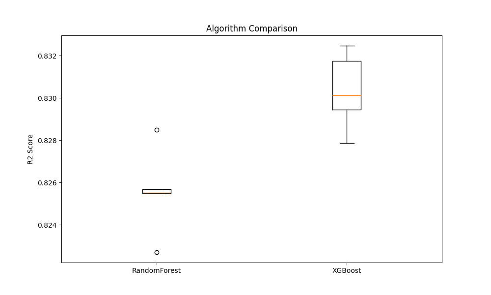

# 🚚 Urban Logistics: AI Latency Predictor

  


## 🔗 Live Demo
Access the live application here: **[Urban Logistics Predictor App](https://urban-logistics-latency-predictor-mbhtgqqsdzwx6khpyffygj.streamlit.app/)**

---
## 📌 Project Overview
In the on-demand economy, the "Last-Mile" delivery phase is the most expensive and unpredictable part of the supply chain. Inaccurate Estimated Time of Arrival (ETA) leads to customer dissatisfaction and inefficient fleet management.

## 🌟 Key Features

### 🧠 Advanced ML Pipeline
*   **XGBoost Regressor:** Optimized using `RandomizedSearchCV` for peak performance ($R^2 \approx 0.84$).
*   **Feature Engineering:** Includes **Traffic-Adjusted Distance**, Prep Time Calculation, and Geodesic clustering.
*   **Robust Preprocessing:** Handles missing data, categorical encoding, and feature scaling automatically.

### 📊 Business Intelligence
*   **Interactive Hotspot Map:** Visualizes high-demand delivery zones to aid fleet allocation.
*   **Efficiency Analytics:** Analyzes Agent Age vs. Delivery Time and Bottleneck detection (Prep Time).

### 🚀 Modern Web Application
*   **Real-time Prediction:** Instant latency estimates based on live parameters.
*   **Explainable AI:** Shows "Route Complexity Score" to explain *why* a delivery is delayed.
*   **Dashboard UI:** Sleek, dark-mode friendly interface built with Streamlit.

## 📂 Project Structure

```bash
Urban-Logistics-Predictor/
├── data/                   # Raw Dataset
├── assets/                 # Generated Maps & Plots
├── models/                 # Saved Models (XGBoost, Scaler)
├── src/                    # Source Code
│   ├── config.py           # Configuration & Mappings
│   ├── preprocessing.py    # Cleaning & Feature Logic
│   ├── train.py            # Training Pipeline
│   ├── evaluate.py         # Model Comparison & Advanced Stats
│   └── insights.py         # Business Intelligence (Maps/Charts)
├── app.py                  # Streamlit Web Application
├── requirements.txt        # Dependencies
├── notebooks/              # Original Experimentation Notebook
└── README.md               # Documentation
```

## 🛠️ How to Run

1.  **Install Dependencies:**
    ```bash
    pip install -r requirements.txt
    ```

2.  **Train the Model (Optional - Models already included):**
    ```bash
    python -m src.train
    ```

3.  **Generate Insights (Optional):**
    ```bash
    python -m src.evaluate
    python -m src.insights
    ```

4.  **Launch the App:**
    ```bash
    streamlit run app.py
    ```

## 📈 Model Performance

| Metric | Score | Interpretation |
| :--- | :--- | :--- |
| **R² Score** | **0.84** | Explains 84% of variance in delivery time. |
| **MAE** | **~3.0 min** | Predictions are accurate within ±3 minutes. |

> The model notably outperforms Random Forest in our benchmarks (see `Analysis` tab in App).
>
> 
